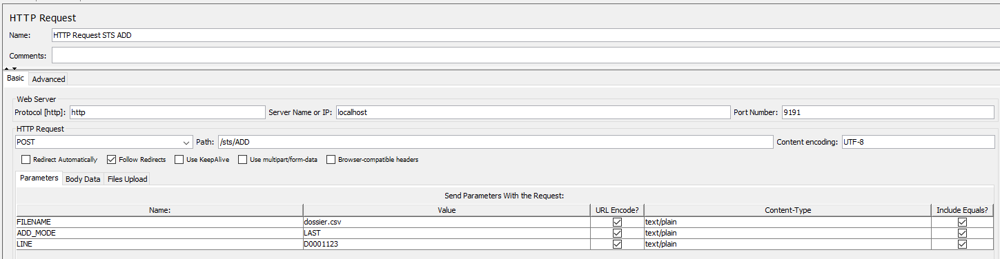
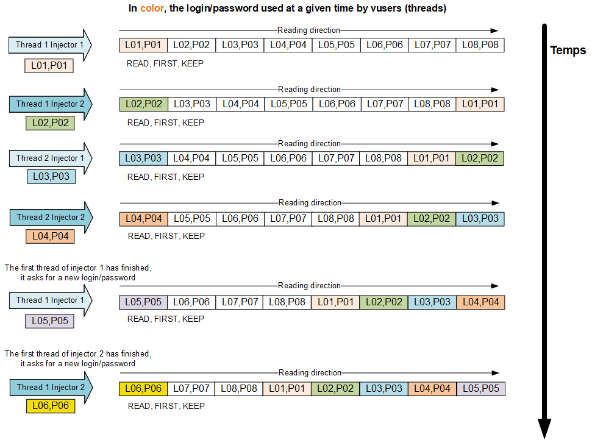
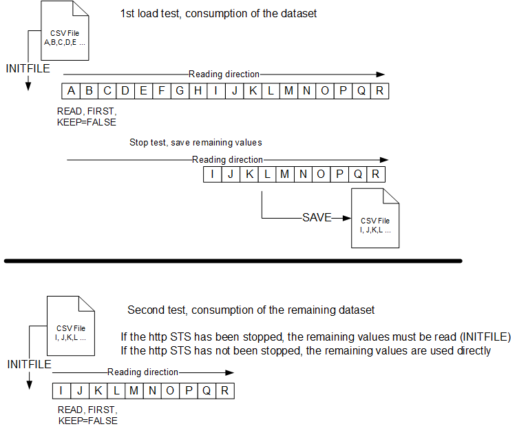
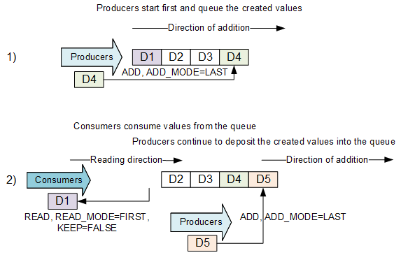

<p align="center">


  <p align="center">Http Simple Table Server (STS) Alone a mini http server to manage the dataset (csv files).</p>
  <p align="center"><a href="https://github.com/vdaburon/simple-table-server-alone">Link to github project simple-table-server-alone</a></p>
</p>


# Http Simple Table Server (STS) Alone
[](https://central.sonatype.com/artifact/io.github.vdaburon/simple-table-server-alone)
[](https://github.com/vdaburon/simple-table-server-alone/blob/main/LICENSE)


## Start the Http Simple Table Server Alone 
<code>java -jar simple-table-server-alone-&lt;version&gt;-jar-with-dependencies.jar</code> <br/>
- Default port : 9191
- Default datasetDirectory : current directory (System.getProperty("user.dir")) 

Notes: 
- Java must be JDK/JRE : version 17 or superior.
- Alone because this tool don't need Apache JMeter, it works by itself or alone.

### Command Line Arguments
Command-line arguments:<br/>
<pre>
-port &lt;listen port number&gt;
-datasetDirectory &lt;path/to/your/directory&gt;
-addTimestamp &lt;true/false&gt;
-daemon &lt;true/false&gt;
-charsetEncodingHttpResponse &lt;charset like UTF-8&gt;
-charsetEncodingReadFile &lt;charset like UTF-8&gt;
-charsetEncodingWriteFile &lt;charset like UTF-8&gt;
-initFileAtStartup &lt;files to read when STS startup, e.g : article.csv,users.csv&gt;
-initFileAtStartupRegex &lt;true/false&gt; &lt;false : no regular expression, files with comma separator, true : read files matching the regular expression&gt;
-stopExit &lt;true/false&gt; If true STOP command stops STS and call System.exit(0), if false STOP command stops STS Server but don't call exit, default true
</pre>

### STS Help Page with use
The URL of an STS command is of the form:<br/>
http&#58;&lt;HOSTNAME&gt;:&lt;PORT&gt;/sts/&lt;COMMAND&gt;?&lt;PARAMETERS&gt;<br/>

The commands and the name of the parameters are in UPPERCASE (case sensitive).<br/>

If no command is specified, the help page is displayed:<br/>
http&#58;//localhost:9191/sts/

# List of commands of the http STS Alone
Commands are :
 - INITFILE - load a csv file in a memory list of lines
 - READ - read a line
 - READMULTI - read multi lines
 - ADD - add a line in a list
 - SAVE - save the list to a file
 - FIND - find a line in a list
 - LENGTH - the length of a list
 - STATUS - display the list of loaded files and the number of remaining lines
 - RESET - remove all elements from the specified list
 - CONFIG - display STS configuration

The calls are atomic (with **synchronized**) => Reading or adding goes to the end of the current processing before processing the next request.

The commands to the Simple Table Server are performed by http GET and/or POST calls depending on the command.


Note: The INITFILE (loading) can be done automatically at STS **startup time** to read files.<br/>

Example of a dataset file logins.csv:<br/>
```TEXT
login1;password1
login2;password2
login3;password3
login4;password4
login5;password5
```

### INITFILE - Load file in memory
http&#58;//hostname:port/sts/**INITFILE**?FILENAME=logins.csv<br/>
HTML format:
```HTML
<html><title>OK</title>
<body>5</body> => number of lines read
</html>
```

Linked list after this command:<br/>
```TEXT
login1;password1
login2;password2
login3;password3
login4;password4
login5;password5
```

The files are read in the directory indicated by the cli argument: **datasetDirectory** and if this cli argument is null then in the directory : System.getProperty("user.dir") <br/>

### READ - Get one line from list
http&#58;//hostname:port/sts/**READ**?READ_MODE={FIRST, LAST, RANDOM}&KEEP={TRUE, FALSE}&FILENAME=logins.csv<br/>
HTML format:
```HTML
<html><title>OK</title>
<body>login1;password1</body>
</html> 
```

Availables options:
- READ_MODE=FIRST => login1;password1
- READ_MODE=LAST => login5;password5
- READ_MODE=RANDOM => login?;password?
- KEEP=TRUE => the data is kept and put to the end of list
- KEEP=FALSE => the data is removed

#### KEEP=TRUE, READ_MODE=FIRST => login1;password1

Linked list after this command:
```TEXT
login2;password2
login3;password3
login4;password4
login5;password5
login1;password1
```

#### KEEP=TRUE, READ_MODE=LAST => login5;password5

Linked list after this command:
```TEXT
login1;password1
login2;password2
login3;password3
login4;password4
login5;password5
```

#### KEEP=TRUE, READ_MODE=RANDOM => login2;password2

Linked list after this command:
```TEXT
login1;password1
login3;password3
login4;password4
login5;password5
login2;password2
```

#### KEEP=FALSE (delete mode), READ_MODE=FIRST => login1;password1

Linked list after this command:
```TEXT
login2;password2
login3;password3
login4;password4
login5;password5
```

#### KEEP=FALSE, READ_MODE=LAST => login5;password5

Linked list after this command:
```TEXT
login1;password1
login2;password2
login3;password3
login4;password4
```

#### KEEP=FALSE, READ_MODE=RANDOM => login2;password2

Linked list after this command:
```TEXT
login1;password1
login3;password3
login4;password4
login5;password5
```

### READMULTI - Get multi lines from list in one request

GET Protocol
http&#58;//hostname:port/sts/**READMULTI**?FILENAME=logins.csv&NB_LINES={Nb lines to read}&READ_MODE={FIRST, LAST, RANDOM}&KEEP={TRUE, FALSE}

Available options:
- NB_LINES=Number of lines to read : 1 <= Nb lines (Integer) and Nb lines <= list size
- READ_MODE=FIRST =>start to read at the first line
- READ_MODE=LAST => start to read at the last line (reverse)
- READ_MODE=RANDOM => read n lines randomly
- KEEP=TRUE => the data is kept and put to the end of list
- KEEP=FALSE => the data is removed
  GET parameters : FILENAME=logins.csv, NB_LINES=Nb lines to read (Integer), READ_MODE=FIRST (Default) or LAST or RANDOM, KEEP=TRUE (Default) or FALSE

E.g : Read first 3 lines, http&#58;//hostname:port/sts/READMULTI?FILENAME=logins.csv&NB_LINES=3&READ_MODE=FIRST&KEEP=true

NB_LINES=3, KEEP=TRUE, READ_MODE=FIRST, KEEP=TRUE => result
```HTML
    <html><title>OK</title>
    <body>
    login1;password1<br />
    login2;password2<br />
    login3;password2<br />
    </body>
    </html>
```
Linked list after this command:
```TEXT
login4;password4
login5;password5
login1;password1
login2;password2
login3;password3
```

If NB_LINES greater than list size
```HTML
    <html><title>KO</title>
    <body>Error : Number lines to read greater than file size, 20 greater than 5 !</body>
    </html>
```

### ADD - Add a line into a file (GET OR POST HTTP protocol)
FILENAME=dossier.csv, LINE=D0001123, ADD_MODE={FIRST, LAST}

HTML format:
```HTML
<html><title>OK</title>
<body></body> 
</html>
```

Available options:
- ADD_MODE=FIRST => add to the begin of the list
- ADD_MODE=LAST => add to the end of the list
- FILENAME=dossier.csv => if doesn't already exist it creates a LinkList in memory
- LINE=1234;98763 => the line to add
- UNIQUE => do not add line if the list already contains such line (return KO)


http POST Request (in Apache JMeter)<br/>


curl POST Request<br/>
<code>curl -X POST http://localhost:9191/sts/ADD -H "Content-Type: application/x-www-form-urlencoded" -d "FILENAME=dossier.csv&LINE=D0001123&ADD_MODE=LAST"</code><br/>

Method GET :<br/>
GET Protocol<br/>
httpv&#58;//hostname:port/sts/**ADD**?FILENAME=dossier.csv&LINE=D0001123&ADD_MODE={FIRST, LAST}

###	FIND – Find a line in the file (GET OR POST HTTP protocol)
Command FIND <br/>
Find a line (LINE) in a file (FILENAME) (GET OR POST HTTP protocol)

The LINE to find is for FIND_MODE :
- A string this SUBSTRING (Default, ALineInTheFile contains the stringToFind) or EQUALS (stringToFind == ALineInTheFile)
- A regular expression with REGEX_FIND (contains) and REGEX_MATCH (entire region the pattern)
- KEEP=TRUE => the data is kept and put to the end of list
- KEEP=FALSE => the data is removed

GET Protocol:<br/>
http&#58;//hostname:port/sts/**FIND**?FILENAME=colors.txt&LINE=(BLUE|RED)&[FIND_MODE=\[SUBSTRING,EQUALS,REGEX_FIND,REGEX_MATCH\]]&KEEP={TRUE, FALSE}

curl POST Request<br/>
<code>curl -X POST http://localhost:9191/sts/FIND -H "Content-Type: application/x-www-form-urlencoded" -d "FILENAME=dossier.csv&LINE=1123&FIND_MODE=SUBSTRING&KEEP=TRUE"</code><br/>

If find return the first line finded, start reading at first line in the file (linked list)
```HTML
<html><title>OK</title>
<body>RED</body>
</html> 
```

If NOT find return title KO and message "Error : Not find !" in the body
```HTML
<html><title>KO</title>
<body>Error : Not find !</body>
</html> 
```
### LENGTH - Return the number of remaining lines of a linked list
http&#58;//hostname:port/sts/**LENGTH**?FILENAME=logins.csv<br/>
HTML format:
```HTML
<html><title>OK</title>
<body>5</body> => remaining lines
</html>
```

### STATUS - Display the list of loaded files and the number of remaining lines
http&#58;//hostname:port/sts/**STATUS**<br/>
HTML format:
```HTML
<html><title>OK</title>
<body>
logins.csv = 5<br />
dossier.csv = 1<br />
</body>
</html>
``` 

### SAVE - Save the specified linked list in a file to the datasetDirectory location
http&#58;//hostname:port/sts/**SAVE**?FILENAME=logins.csv

If addTimestamp is set to true then a timestamp will be added to the filename, the file is stored in datasetDirectory or if null in the &lt;JMETER_HOME&gt;/bin directory:<br/>
20260120T16h33m27s.logins.csv

You can force the addTimestamp value with parameter ADD_TIMESTAMP in the url like :
http&#58;//hostname:port/sts/SAVE?FILENAME=logins.csv&**ADD_TIMESTAMP**={true,false}

HTML format:
```HTML
<html><title>OK</title>
<body>5</body> => number of lines saved
</html>
```

### RESET - Remove all elements from the specified list:
http&#58;//hostname:port/sts/**RESET**?FILENAME=logins.csv

HTML format:
```HTML
<html><title>OK</title>
<body></body>
</html>
```

Reset Command is often used in the “setUp” to clear the values in memory Linked List from a previous test.

Always returns OK even if the file did not exist

### STOP - Shutdown the Simple Table Server:
http&#58;//hostname:port/sts/**STOP**

The stop command is used usually when the HTTP STS server was launched by a script shell and we want to stop the STS at the end of the test.<br/>
When the daemon=true, you need to call http&#58;//hostname:port/sts/STOP or kill the process to stop the STS<br/>
Cli parameter: -stopExit &lt;true/false&gt; If true STOP command stops STS and call System.exit(0), if false STOP command stops STS Server but don't call exit, default true

### CONFIG – Display STS configuration
http&#58;//hostname:port/sts/**CONFIG**<br/>
Display the STS configuration<br/>
E.g :
```TEXT
port=9191
datasetDirectory=data
datasetDirectory (canonical)=C:\simple-table-server-alone\data
addTimestamp=true
demon=true
charsetEncodingHttpResponse=UTF-8
charsetEncodingReadFile=UTF-8
charsetEncodingWriteFile=UTF-8
initFileAtStartup=
initFileAtStartupRegex=false
stopExit=true
databaseIsEmpty=true
```

### Error response KO
When the command and/or a parameter are wrongs, the result is a page html status 200 but the **title** contains the label **KO**.

Examples :
Send a unknown command, be careful Command are case sensitive (READ != read)<br/>
```HTML
<html><title>KO</title>
<body>Error : unknown command !</body>
</html>
```

Try to read value from a file not yet load with INITFILE<br/>
```HTML
<html><title>KO</title>
<body>Error : logins.csv not loaded yet !</body>
</html>
```

Try to read value from a file but no more line in the Linked List<br/>
```HTML
<html><title>KO</title>
<body>Error : No more line !</body>
</html>
```

Try to save lines in a file what contains illegal character like “..”, “:”<br/>
```HTML
<html><title>KO</title>
<body>Error : Illegal character found !</body>
</html>
```

Command FIND<br/>
```HTML
<html><title>KO</title>
<body>Error : Not find !</body>
</html>
```

Command FIND and FIND_MODE=REGEX_FIND or REGEX_MATCH<br/>
```HTML
<html><title>KO</title>
<body>Error : Regex compile error !</body>
</html>
```
## CLI Help 
<pre>
usage: io.github.vdaburon.sts.HttpSimpleTableServer [-addTimestamp &lt;addTimestamp&gt;] [-charsetEncodingHttpResponse
&lt;charsetEncodingHttpResponse&gt;] [-charsetEncodingReadFile &lt;charsetEncodingReadFile&gt;] [-charsetEncodingWriteFile
&lt;charsetEncodingWriteFile&gt;] [-daemon &lt;daemon&gt;] [-datasetDirectory &lt;datasetDirectory&gt;] [-help] [-initFileAtStartup
&lt;initFileAtStartup&gt;] [-initFileAtStartupRegex &lt;initFileAtStartupRegex&gt;] [-port &lt;port&gt;] [-traceLevel &lt;traceLevel&gt;]
io.github.vdaburon.sts.HttpSimpleTableServer
-addTimestamp &lt;addTimestamp&gt;                                 Add timestamp prefix when save file
-charsetEncodingHttpResponse &lt;charsetEncodingHttpResponse&gt;   In the http header add "Content-Type:text/html;
charset=&lt;charsetEncoding&gt;", default (UTF-8)
-charsetEncodingReadFile &lt;charsetEncodingReadFile&gt;           Charset to read the file in memory
-charsetEncodingWriteFile &lt;charsetEncodingWriteFile&gt;         Charset to write (save) the file
-daemon &lt;daemon&gt;                                             If true daemon process don't wait keyboards key pressed
for nohup command, if false (default) wait keyboards key
&lt;ENTER&gt; to Stop
-datasetDirectory &lt;datasetDirectory&gt;                         Directory where csv files are read or save (default :
current directory where this tool is launch)
-help                                                        Help and show parameters
-initFileAtStartup &lt;initFileAtStartup&gt;                       Files to read at startup
-initFileAtStartupRegex &lt;initFileAtStartupRegex&gt;             Is the liste files to read is a regular expression (true)
or a list of files (false) ? default false
-port &lt;port&gt;                                                 Listening port (default 9191)
-stopExit &lt;stopExit&gt;                                         If true STOP command stops STS and call System.exit(0), if
                                                              false STOP command stops STS Server but don't call exit,
                                                              default true
-traceLevel &lt;traceLevel&gt;                                     Trace level WARN, INFO (default), DEBUG
E.g: java -jar simple-table-server-alone-&lt;version&gt;-jar-with-dependencies.jar -port 9191 -datasetDirectory "/sts/data"
-addTimestamp true -daemon true
</pre>

# Tutorial Manage the dataset with Http Simple Table Server (STS)
## Adding centralized management of the dataset

The main idea is to use a small http server to manage the dataset files with simple commands to retrieve, find or add data lines to the data files.

This http server is launched alone in an external program.

The Http server is called "**S**imple **T**able **S**erver" or STS Alone.

The name STS is also a reference to the Virtual Table Server (VTS) program of LoadRunner with different functionalities, a different technical implementation but close in the use cases.

## Some possibilities of using the Http Simple Table Server
### Reading data in a distributed and collision-free way
Some applications **do not tolerate** that **2 users** connect with the **same login** at the **same time**.<br/>

It is often recommended not to use the same data for 2 users connected with the same login at the same time to avoid conflicts on the data used.<br/>
The STS can easily manage the dataset in a distributed way to ensure that logins are different for each virtual user at a given time T of the test.<br/>

A dataset with logins/passwords with a number of lines greater than the number of active threads at a given time is required.<br/>

We manually load, at the start of the STS or by calling INITFILE command the logins/password file and the injectors ask the STS for a line with login/password by the command READ, KEEP=TRUE and READ_MODE=FIRST.

We can consider that the reading of the dataset is done in a circular way.



### Reading single-use data
The dataset can be single-use, meaning that it is used only once during the test.<br/>
For example, people who register on a site can no longer register with the same information because the system detects a duplicate.

Documents are awaiting validation by an administrator, when the documents are validated, they are no longer in the same state and can no longer be validated again.

To do this, we will read a data file in memory of the http STS and the virtual users will read by deleting the value at the top of the list.

When the test is stopped, we can save the values that remain in memory in a file (with or without a timestamp prefix) or let the http STS run for another test while keeping the values still in memory.



### Producers and consumers of a queue

With the STS, we can manage a queue with producers who deposit in the queue and consumers who consume the data of the queue.

In practice, we start a script with producers who create data like new documents or new registered people. The identifiers of created documents or the information of newly registered people are stored in the http STS by the ADD command in mode ADD_MODE=LAST 

The consumers start a little later so that there is data in the queue.<br/>
It is also necessary that the consumers do not consume too quickly compared to the producers or it is necessary to manage the case where the list no longer contains a value by detecting that there is no more value available and waiting a few seconds before repeating in a loop.

The consumers consume the values by the command READ, FIRST, KEEP=FALSE.

A schema to explains the producers ADD and consumers READ at the same queue. 



### Producer and consumer with search by FIND
This is a variation of the previous solution.<br/>
Producer:<br/>
A user with rights limited to a geographical sector creates documents and adds a line with his login + the document number. (ex: **login23;D12223**)<br/>
- login1;D120000
- login2;D120210
- **login23;D12223**
- login24;D12233
- login2;D120214
- login23;D12255

Consumer:<br/>
A user will modify the characteristics of the document but to do so he must choose from the list in memory **only the lines with the same login** as the one he currently uses for questions of rights and geographic sector.<br/>
Search in the list with the FIND command and FIND_MODE=SUBSTRING and the string searched for is the login of the connected person (ex: login23) so LINE=**login23;** (with the separator ;).<br/>
In this example, the returned line will be the 1st line with login23 and the file number will be used in searching for files in the tested application.<br/>
Here the result of the FIND by substring (SUBSTRING) is: **login23;D12223** <br/>
The line can be consumed with KEEP=FALSE or kept and placed at the end of the list with KEEP=TRUE

### Enrich the dataset as the load test progresses
The idea is to start with a reduced dataset that is read at the start of the load test and to add new lines to the initial dataset as the load test progresses in order to increase or enrich the dataset.
The dataset is therefore larger at the end of the load test than at the beginning. At the end of the load test, the enriched dataset can be saved with the SAVE command and the new file can be the future input file for a new load test. <br/>
For example, we add people by a scenario and we add to the search dataset these people in the list so the search is done on the first people of the file read at the beginning but also the people added as the performance test progresses.

### Verification of the dataset
The initial dataset can contain values that will generate errors in the script because the navigation falls into a particular case or the entered value is refused because it is incorrect or already exists.

We read the dataset by INITFILE or at the start of the STS, we read (READ) and we use the value if the script goes to the end, we save the value by ADD in a file (valuesok.csv). At the end of the test, the values of the valuesok.csv file are saved.<br/>
The verified data of the valuesok.csv file will then be used

### Storing the added values in a file.
In the script, the values added to the application database are saved in a file by the ADD command. At the end of the test, the values in memory are saved in a file.<br/>
The file containing the created values can be used to verify the additions to the database a posteriori or to delete the created values in order to return to an initial state before the test.<br/>

A script dedicated to creating a data set can create values and store them in a data file. This file will then be used in the script during performance tests.

On the other hand, a dedicated erase script can take the file of created values to erase them in a loop.

### Communication between software
The http STS can be used as a means to communicate values between software.<br/>
The software can be a heavy client, a web application, a shell script, a Selenium/Selenide test, JMeter, a LoadRunner …

We can also launch 2 tests to store values created by the 1st test and used in the 2nd test.

The software can add or read values by calling the url of the http STS.

This possibility facilitates no-regression tests but also performance tests.

### Start from command line.
It is possible to start the STS server from command line.<br/>
start-sts.cmd (Windows OS)<br/>
start-sts.sh (Linux OS)


The default port is 9191, it can be changed by the cli argument<br/>
 -port 9191<br/>
If port=0 then the STS does not start when launching JMeter in CLI mode.

The cli argument -addTimestamp true indicates if the backup of the file (eg info.csv) will be prefixed by the date and time, eg: 20260112T13h00m50s.info.csv otherwise addTimestamp=false writes/overwrites the file info.csv<br/>
 -addTimestamp true

The cli argument daemon=true is used when the STS is launched as an external application with the linux nohup command (example: nohup ./start-sts.sh &).<br/>
In this case the STS does not listen to the keyboard the &lt;ENTER&gt; key to exit.<br/>
The STS enters an infinite loop, you must call the /sts/STOP command to stop the STS or the killer.<br/>

When daemon=false the STS waits for the entry of &lt;ENTER&gt; to exit, this is the default mode.<br/>
 -daemon false

## Loading files at Simple Table Server startup
The STS has the ability to load files into memory at STS startup.<br/>

The files are read in the directory indicated by the cli argument: **datasetDirectory** and if this cli argument is null then in the directory : System.getProperty("user.dir")<br/>

The declaration of the files to be loaded is done by the following cli arguments:<br/>
-initFileAtStartup "article.csv,filename.csv"<br/>
-initFileAtStartupRegex false<br/>
or<br/>
-initFileAtStartup ".+?\.csv"<br/>
-initFileAtStartupRegex true<br/>

When initFileAtStartupRegex=false then the cli argument initFileAtStartup contains the list of files to be loaded with the comma character "," as the file name separator.
E.g:
-initFileAtStartup "article.csv,filename.csv"<br/>
The STS at startup will try to load (INITFILE) the files articles.csv then filename.csv

When initFileAtStartupRegex=true then the cli argument initFileAtStartup contains a regular expression that will be used to match the files in the directory of the cli argument datasetDirectory.

E.g:
-initFileAtStartup ".+?\.csv"<br/>
Loads into memory (INITFILE) all files with the extension ".csv"<br/>

The file name must not contain special characters that would allow changing the reading directory such as ..\..\fichier.csv or /etc/passwd or ../../../tomcat/conf/server.xml

The maximum size of a file name is 128 characters (without taking into account the directory path).

## Management of the encoding of files to read/write and the html response
It is possible to define the encoding when reading files or writing data files.<br/>
The cli arguments are as follows:<br/>
read (INITFILE) or write (SAVE) file with accent from text file in the charset like UTF-8 or ISO8859_15<br/> 
All csv files need to be in the same charset encoding<br/>
-charsetEncodingReadFile UTF-8<br/>
-charsetEncodingWriteFile UTF-8<br/>

Files will be read (INITFILE) with the charset declared by the value of charsetEncodingReadFile<br/>
Files will be written (SAVE) with the charset declared by the value of charsetEncodingWriteFile<br/>

The default value charsetEncodingReadFile corresponds to the System property: file.encoding<br/>

The default value charsetEncodingWriteFile corresponds to the System property: file.encoding<br/>

All data files must be in the same charset if they contain non-ASCII characters.

To respond in HTML to the different commands, especially READ, the charset found in the response header is indicated by charsetEncodingHttpResponse.

-charsetEncodingHttpResponse <charset> (Use UTF-8) in the http header add "Content-Type:text/html; charset=&lt;charset&gt;",<br/>
The list of charsets is declared in the HTML page (take the java.io API column)<br/>
&#35; For the name of the charset look at : https://docs.oracle.com/javase/8/docs/technotes/guides/intl/encoding.doc.html<br/>
&#35; Colum Canonical Name for java.io API and java.lang API

## Related Tool Link
Link to jmeter-plugins.org documentation (STS JMeter Plugins) 
[https://jmeter-plugins.org/wiki/HttpSimpleTableServer/](https://jmeter-plugins.org/wiki/HttpSimpleTableServer/)

## Use this tool in a java program
This tool could be call in a Java Program.
```JAVA
package io.github.vdaburon.stsdemo;

import io.github.vdaburon.sts.HttpSimpleTableServer;
import java.net.URI;
import java.net.http.HttpClient;
import java.net.http.HttpRequest;
import java.net.http.HttpResponse;

public class DemoCallSts extends Thread {
    int port = 9191;
    public static void main(String[] args) {
        System.out.println("Begin main");
        DemoCallSts demo = new DemoCallSts();
        // start the STS Alone
        demo.start();
        try {
            // Sleep 4 sec
            Thread.sleep(4000);
        } catch (InterruptedException e) {
            throw new RuntimeException(e);
        }
        // stop the STS
        demo.stopSts();
        System.out.println("After the stopSts");
        System.out.println("End main");
        System.exit(0);
    }

    private void stopSts() {
        System.out.println("Begin stopSts");
        HttpRequest request = HttpRequest.newBuilder()
                .uri(URI.create("http://localhost:" + port + "/sts/STOP"))
                .build();
        HttpClient client = HttpClient.newHttpClient();
        try {
            HttpResponse<String> response = client.send(request, HttpResponse.BodyHandlers.ofString());
            // If you want to call STS command with a response likes /sts/CONFIG
            //String sReponse = new String(response.body().getBytes(StandardCharsets.UTF_8), StandardCharsets.UTF_8);
            //System.out.println("sReponse="+ sReponse);
        } catch (Exception e) {
            // When calling STOP command, the STS close the connection without response => java.net.ConnectException
            System.out.println("Exception :"  + e);
        }
        System.out.println("End stopSts");
    }

    public void run() {
        System.out.println("Begin run");
        String sStopExit = "false"; // When the STS stops don't call the System.exit(0) => current main program still continue
        String[] ststArgs = new String[]{"-port", "" + port, "-daemon", "true", "-stopExit", sStopExit};
        HttpSimpleTableServer.main(ststArgs);
        System.out.println("End run");
    }
}
```
## Usage Maven
The maven groupId, artifactId and version, this plugin is in the **Maven Central Repository** [](https://central.sonatype.com/artifact/io.github.vdaburon/simple-table-server-alone)

```xml
<groupId>io.github.vdaburon</groupId>
<artifactId>simple-table-server-alone</artifactId>
<version>5.0</version>
```

## License
Licensed under the Apache License, Version 2.0

## Versions
Version 5.0 2026-01-30, first version with same features as JMeter plugins STS V5.0 (https://jmeter-plugins.org/wiki/HttpSimpleTableServer/)